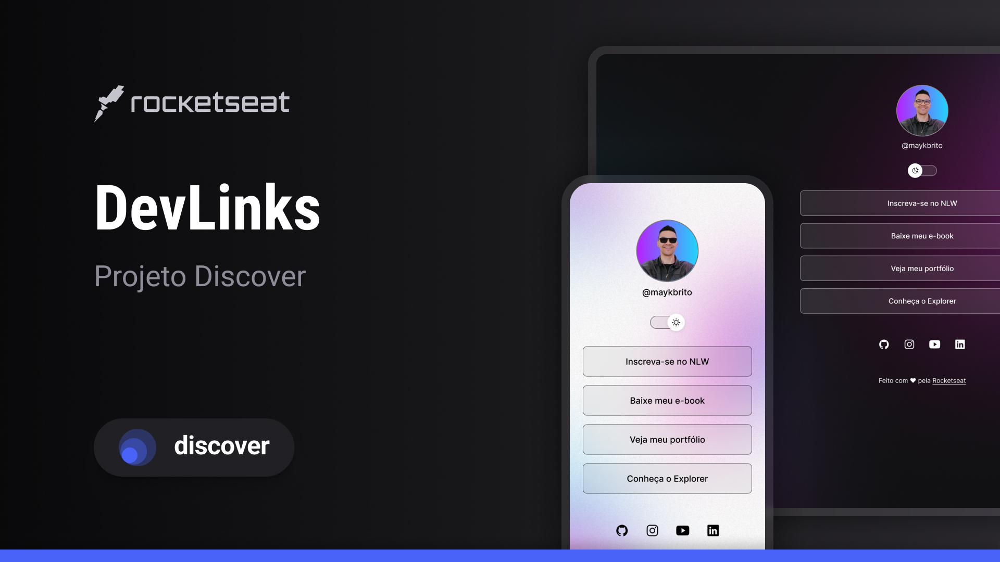

<h1 align="center">Perfil</h1>

Programa feito por Lucas Calixto, pelo curso Discover da rocketseat para ensino de tecnologias WEB.

## 🚀 Tecnologias

Esse projeto foi desenvolvido com as seguintes tecnologias:

- HTML e CSS
- JavaScript
- Git e Github
- Figma

## 💻 Projeto

Projeto de cartão de visitas online para mostrar minhas redes e portifólio.